# 📖 VectorMotion — Manual de uso

**Editor de gráficos SVG y animación por keyframes, en un solo archivo HTML.**
Pensado para enseñar y aprender animación: dibujas vectores (o importas SVG y animaciones Lottie), los animas con keyframes, rutas de movimiento, morphing y transiciones de escena, y exportas SVG animados que funcionan en cualquier navegador — o código GSAP para desarrolladores — sin marcas de agua, sin límites, sin conexión.

---

## Índice

1. [Puesta en marcha](#1-puesta-en-marcha)
2. [Mapa de la interfaz](#-2-mapa-de-la-interfaz)
3. [Herramientas de dibujo](#-3-herramientas-de-dibujo)
4. [Selección y transformación](#4-selección-y-transformación)
5. [Edición de nodos Bézier](#-5-edición-de-nodos-bézier)
6. [Capas](#-6-capas)
7. [Animación por keyframes](#-7-animación-por-keyframes)
8. [Easing y editor de curvas](#8-easing-y-editor-de-curvas)
9. [La línea de tiempo a fondo](#-9-la-línea-de-tiempo-a-fondo)
10. [Rutas de animación (motion paths)](#10-rutas-de-animación-motion-paths)
11. [Morphing de geometría](#11-morphing-de-geometría)
12. [Trazo autodibujable](#-12-trazo-autodibujable)
13. [Efectos de vídeo](#13-efectos-de-vídeo)
14. [Escenas y transiciones](#-14-escenas-y-transiciones)
15. [Papel cebolla](#15-papel-cebolla)
16. [Lienzo desacoplable (segunda pantalla)](#-16-lienzo-desacoplable-segunda-pantalla)
17. [Navegación del lienzo, cuadrícula y reglas](#17-navegación-del-lienzo-cuadrícula-y-reglas)
18. [Importar y exportar](#-18-importar-y-exportar)
19. [Guardar, autoguardado y proyectos](#-19-guardar-autoguardado-y-proyectos)
20. [Personalizar la interfaz](#-20-personalizar-la-interfaz)
21. [Atajos de teclado](#-21-atajos-de-teclado)
22. [Ideas para el aula](#-22-ideas-para-el-aula)
23. [Solución de problemas](#-23-solución-de-problemas)

---

## 1. Puesta en marcha
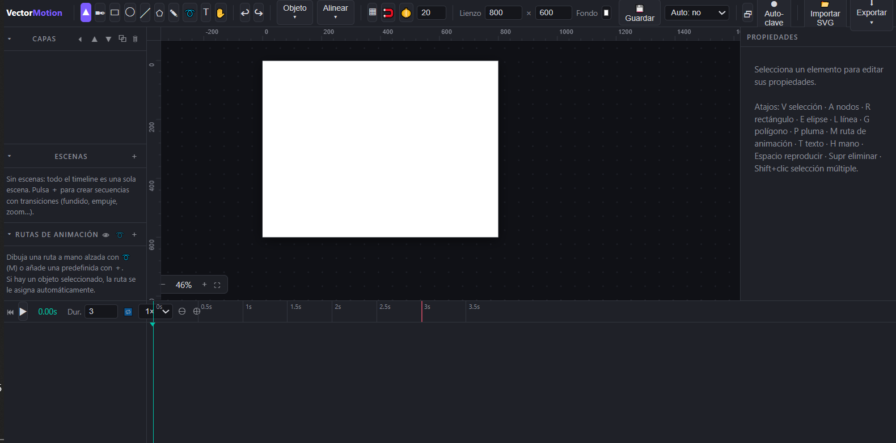
VectorMotion es una app almacenada en un único archivo `index.html`. Funciona en cualquier navegador moderno (Chrome o Edge recomendados. No necesita instalación, servidor ni internet.

Al abrir aparece un lienzo vacío, si existe un autoguardado de una sesión anterior la app ofrece restaurarlo (ver [§19](#-19-guardar-autoguardado-y-proyectos)).

---

## 🗺️ 2. Mapa de la interfaz
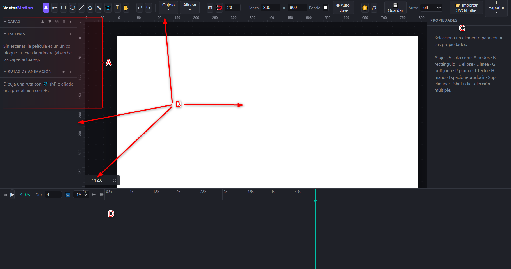

  

- 🗄️ **Columna izquierda**: tres paneles apilados — Capas, Escenas y Rutas de animación. Cada uno se pliega con un clic en su título y toda la columna se colapsa con ⏴ para maximizar el lienzo (ver [§20](#-20-personalizar-la-interfaz)).
- 📄 **Lienzo central**: el documento SVG con reglas, cuadrícula opcional y controles de zoom (abajo a la izquierda).
- ✨ **Panel derecho**: propiedades del objeto seleccionado — transformación, apariencia, geometría, escena, trayectoria de movimiento y efectos.
- 📅 **Abajo**: la línea de tiempo, de altura ajustable.

Los mensajes de ayuda contextual aparecen en una pastilla flotante sobre el lienzo.

---

## 📐 3. Herramientas de dibujo

| Botón | Atajo | Herramienta          | Uso                                                                                                                                                   |
| ------ | ----- | -------------------- | ----------------------------------------------------------------------------------------------------------------------------------------------------- |
| ▲     | `V`   | Selección           | Seleccionar, mover, rotar, escalar                                                                                                                    |
| ✒     | `A`   | Nodos                | Editar anclas y manejadores Bézier                                                                                                                   |
| ▭     | `R`   | Rectángulo          | Arrastra; `Shift` = cuadrado                                                                                                                           |
| ◯     | `E`   | Elipse               | Arrastra; `Shift` = círculo                                                                                                                           |
| ╱     | `L`   | Línea               | Arrastra de un extremo a otro                                                                                                                         |
| ⬠     | `G`   | Polígono / Estrella | Arrastra **desde el centro**; lados, estrella y radio interior se ajustan en Propiedades                                                               |
| ✎     | `P`   | Pluma                | Clic añade nodo recto; **clic y arrastra** crea nodo curvo con manejadores; clic sobre el primer punto cierra; `Enter` termina abierto; `Esc` cancela |
| ➰     | `M`   | Ruta de animación   | Dibuja a mano alzada una trayectoria de movimiento (ver [§10](#10-rutas-de-animación-motion-paths))                                                  |
| T      | `T`   | Texto                | Clic donde quieras el texto; se pide el contenido                                                                                                     |
| ✋     | `H`   | Mano                 | Arrastra para desplazar la vista (también con la rueda o botón central)                                                                             |

Cada forma nueva se convierte en una capa con nombre editable. Tras dibujar, la app vuelve automáticamente a la herramienta de selección.

---

## 4. Selección y transformación
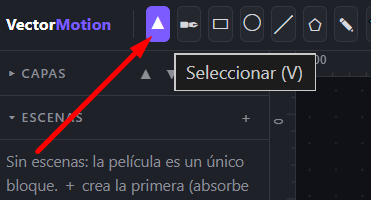

Con la herramienta **Selección (V)**:

- ℹ️ **Clic** selecciona; **Shift/Ctrl+clic** añade o quita de la selección múltiple. `Esc` deselecciona.
- 🔘 **Arrastrar** el objeto lo mueve (con imán a la cuadrícula si está activo). Flechas del teclado mueven 1 px; con `Shift`, 10 px.
- **Esquinas cuadradas**: escala. `Shift` mantiene la proporción.
- 👣 **Círculo superior**: rotación. `Shift` ajusta a pasos de 15°.
- 🌐 **Cruz roja ⌖**: es el **origen de transformación** (el punto alrededor del cual rotan y escalan las cosas). Arrástralo donde quieras — por ejemplo, al hombro de un brazo para articularlo. "Centrar origen" en Propiedades o en el menú Objeto lo devuelve al centro geométrico.

**Menú Objeto**: agrupar (`Ctrl+G`) / desagrupar (`Ctrl+Shift+G`), unión de formas (combina 2+ formas en un solo trazado), voltear horizontal/vertical, girar ±90°, centrar origen, convertir a trazado y suavizar trazado (convierte una polilínea de la pluma en curvas suaves Catmull-Rom).

**Menú Alinear**: con un solo objeto alinea respecto al lienzo; con varios, respecto al conjunto (izquierda, centro, derecha, arriba, medio, abajo).

> ⚠️ Al **agrupar** capas animadas se pierden sus animaciones individuales (el grupo pasa a animarse como conjunto). La app avisa antes.

---

## 🕸️ 5. Edición de nodos Bézier
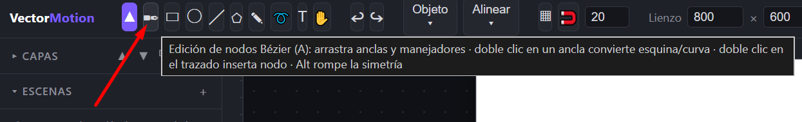
Activa la herramienta **Nodos (A)** con un trazado seleccionado (las formas primitivas se convierten a trazado automáticamente, con confirmación si tienen animación de geometría).

- ⚓ **Arrastra un ancla** (cuadrado) para moverla; sus manejadores la acompañan.
- 🕸️ **Arrastra un manejador** (círculo) para curvar el segmento. En nodos suaves, el manejador opuesto se mantiene simétrico; **Alt** rompe la simetría (esquina).
- 💻 **Doble clic en un ancla**: alterna esquina ⇄ curva suave.
- 🗄️ **Doble clic sobre el trazado**: inserta un nodo en ese punto (subdivisión exacta de la curva).
- 🔘 **Supr**: elimina el nodo seleccionado (mínimo 2 por trazado).
- `Esc` sale de la edición.

Los nodos redondeados indican curva suave; los cuadrados, esquina. Si el trazado es la fuente de una ruta de animación, los objetos que la siguen se actualizan en vivo mientras editas.

**Limitación**: los trazados con comandos de arco (`A`) o coordenadas relativas no son editables por nodos ni compatibles con la unión (la app avisa). Los SVG importados como capa `raw` tampoco, hasta desagruparlos.

---

## 📚 6. Capas
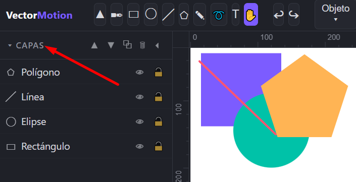
El panel **Capas** lista los objetos de arriba (delante) hacia abajo (detrás).

- ℹ️ **Clic**: seleccionar (Shift/Ctrl para múltiple). **Doble clic**: renombrar.
- 🔄 👁 visibilidad · 🔒 bloqueo (no se puede seleccionar ni mover).
- ✨ Botones del título: ▲▼ reordenar, ⧉ duplicar (copia también sus animaciones), 🗑 eliminar.
- ℹ️ El icono indica el tipo: ▭ ◯ ╱ ⬠ ✎ T 🧩 (grupo o SVG importado).

Las capas de tipo **grupo/importado** (🧩) se transforman y animan como un todo; usa Objeto → Desagrupar para separar sus elementos.

---

## 🔑 7. Animación por keyframes
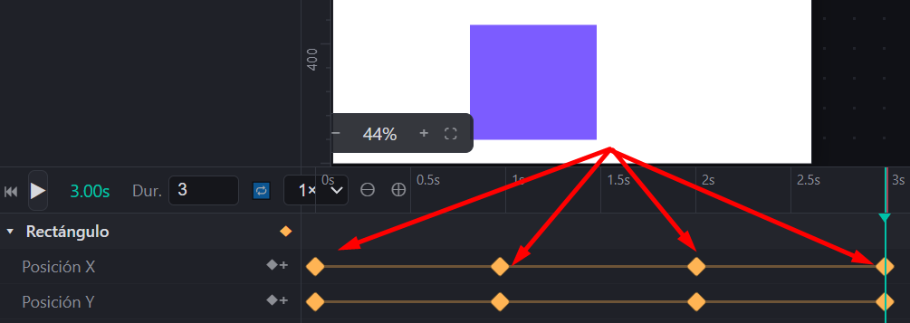
El modelo es el clásico de After Effects/SVGator: cada propiedad animable de cada capa tiene su propia pista de **keyframes** (rombos ◆); entre dos claves el valor se **interpola** con la curva de easing de la clave de salida.

### Propiedades animables

| Propiedad       | Dónde está                            | Qué interpola                                                      |
| --------------- | --------------------------------------- | ------------------------------------------------------------------- |
| Posición X / Y | Transformación                         | Traslación en px                                                   |
| Rotación       | Transformación                         | Grados, alrededor del origen ⌖                                     |
| Escala X / Y    | Transformación                         | Factores (negativos = volteado)                                     |
| Sesgo X / Y     | Transformación                         | Cizalladura en grados                                               |
| Opacidad        | Transformación                         | 0–1                                                                |
| Color           | Apariencia (Relleno; en líneas, Trazo) | Interpolación RGB componente a componente                          |
| Trayecto %      | Trayectoria de movimiento               | Posición a lo largo de la ruta (0–100)                            |
| Dibujo trazo %  | Apariencia                              | Porción del contorno dibujada (ver [§12](#-12-trazo-autodibujable)) |
| Geometría      | Encabezado "Geometría"                 | La forma completa: morphing (ver [§11](#11-morphing-de-geometría)) |

### 🔑 Crear y editar keyframes

- 🔑 **Rombo ◆ junto a cada campo** en Propiedades: crea (o quita) una clave de esa propiedad en el tiempo actual. Amarillo = la propiedad está animada; relleno = hay clave exactamente en este instante.
- 🔑 **⏺ Auto-clave**: mientras está activo, cualquier edición (mover, rotar, cambiar color…) crea claves automáticamente en el tiempo actual. Es el flujo más rápido: activa auto-clave, colócate en t=0, posa; muévete a t=1, posa; etc.
- 🔑 Si una propiedad ya tiene claves, editarla en cualquier instante **siempre** crea/actualiza la clave de ese instante (haya auto-clave o no).
- 📅 En la línea de tiempo, botón **◆+** de cada fila de propiedad: clava el valor actual.

### 📅 En la línea de tiempo

- 💻 Clic en el nombre de una capa: la selecciona y **expande/colapsa** sus filas de propiedades.
- 🔑 La fila de la capa muestra un agregado de todas sus claves cuando está colapsada.
- 📅 **Arrastra un rombo** horizontalmente para cambiar su tiempo.
- 🔑 **Clic en un rombo** abre el popup: easing, tiempo exacto (numérico) y 🗑 eliminar. `Supr` también elimina la clave seleccionada.

---

## 8. Easing y editor de curvas
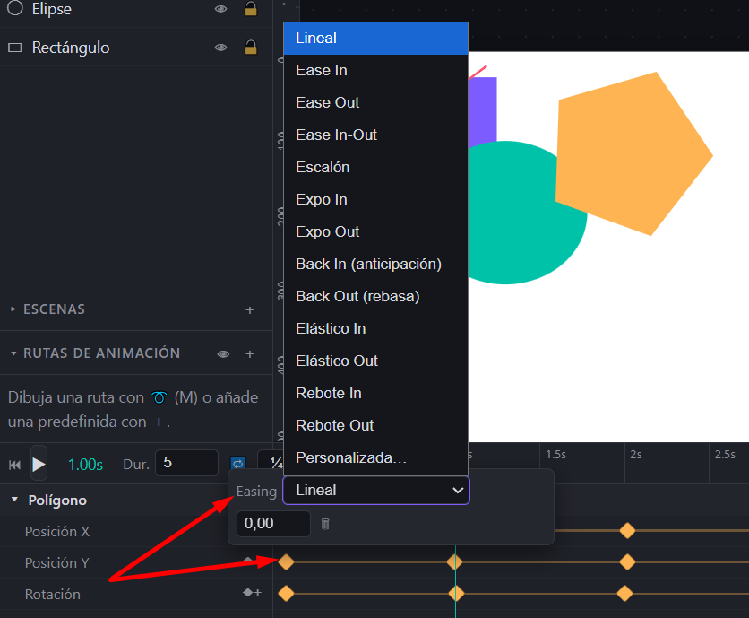
El *easing* define la aceleración del cambio entre una clave y la siguiente. Se asigna **por keyframe** (a la clave de salida del tramo) en el popup del rombo:

- ⏱️ **Lineal** — velocidad constante (robótico).
- 🐢 **Ease In** — arranca lento, termina rápido (salidas, caídas).
- **Ease Out** — arranca rápido, frena al llegar (entradas naturales).
- 🪶 **Ease In-Out** — suave en ambos extremos.
- 🔑 **Escalón** — sin interpolación: salta en la clave siguiente (útil para parpadeos o stop-motion).

Y ocho curvas avanzadas de la familia Penner (las mismas que popularizó GSAP):

- ✨ **Expo In / Expo Out** — versión extrema del ease in/out: arranque o frenada muy pronunciados.
- ⏮️ **Back In (anticipación)** — retrocede un poco antes de salir, como quien toma impulso.
- 🔑 **Back Out (rebasa)** — se pasa del destino y vuelve: el overshoot clásico sin claves extra.
- **Elástico In / Out** — oscilación de muelle que se amortigua.
- 🏐 **Rebote In / Out** — bota contra el destino como una pelota.

> Estas ocho no caben en una `cubic-bezier`: al exportar a **CSS** y **SMIL** se reproducen por **muestreo denso automático** (hasta 150 pasos con interpolación lineal). Las exportaciones **JS** y **GSAP** las incluyen de forma exacta.

- 👤 **Personalizada…** — abre el **editor de curvas**.

### El editor de curvas
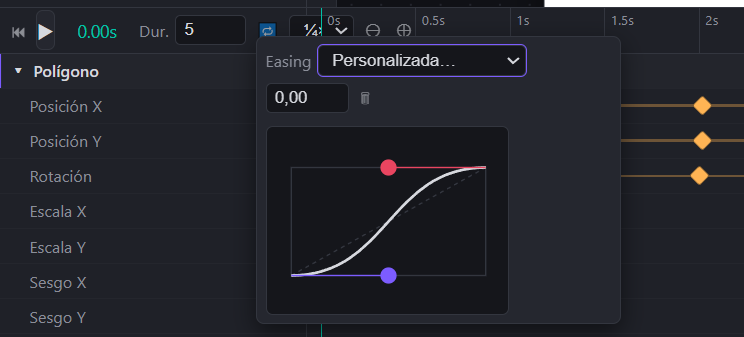
Al elegir "Personalizada…" aparece una gráfica: el eje horizontal es el **tiempo** del tramo (0→1) y el vertical el **progreso** del valor (0→1). La diagonal punteada es el movimiento lineal de referencia.

- 🚩 Arrastra el manejador **violeta** (control de salida) y el **rojo** (control de llegada). La curva y el lienzo se actualizan en vivo.
- 🔑 Los manejadores pueden salir del cuadro por arriba/abajo (**overshoot**): el valor rebasa su destino y vuelve — así se hacen rebotes y anticipaciones sin claves extra.
- ℹ️ La curva es una cúbica tipo `cubic-bezier` de CSS y se conserva al exportar (en SMIL el overshoot se recorta, porque el formato no lo admite).

Para leer la curva con estudiantes: pendiente = velocidad. Plana al inicio = arranque suave; casi vertical = golpe de velocidad.

---

## 📅 9. La línea de tiempo a fondo
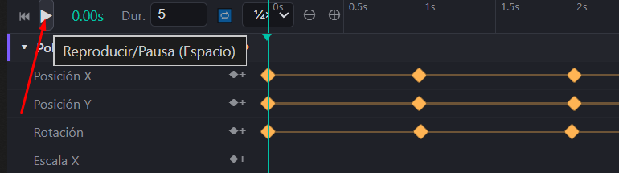
- 🚀 **⏮** ir al inicio · **▶/⏸** reproducir (`Espacio`) · el tiempo actual se muestra en verde.
- 📄 **Dur.** — duración del documento en segundos (si hay escenas, se calcula sola).
- 🔄 **🔁** — repetir en bucle.
- ⏱️ **Velocidad ¼×/½×/1×/2×** — cámara lenta para analizar el movimiento (no afecta a la exportación).
- 📅 **⊖/⊕** — zoom de la línea de tiempo (18–800 px/segundo, centrado en el instante visible). La regla adapta la densidad de marcas.
- 🔄 **Scrub**: arrastra sobre la regla (o una zona vacía de las pistas) para mover el cabezal.
- 💡 **Bucle A-B**: `Alt+clic` en la regla fija el punto A; otro `Alt+clic`, el B (franja verde). La reproducción queda confinada a ese tramo — ideal para pulir un gesto. Un tercer `Alt+clic` lo elimina.
- ⋯ **Rueda del ratón**: rueda = desplazamiento vertical de pistas; `Ctrl+rueda` = desplazamiento horizontal; sobre la regla, la rueda desplaza horizontalmente.
- ❯ **Barras de desplazamiento**: gruesas, estilo Windows 95, con botones de flecha.
- 📅 **Altura**: arrastra el borde superior de la línea de tiempo (se ilumina al pasar el ratón). Se recuerda entre sesiones.
- 🔑 La línea roja vertical marca el **fin de la duración**; puede haber claves más allá (no se reproducen ni exportan).

---

## 10. Rutas de animación (motion paths)
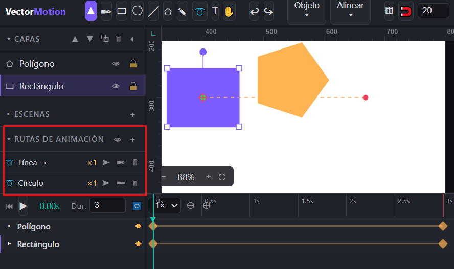
Una **ruta de animación** es un trazado invisible que un objeto recorre, como la "Trayectoria personalizada" de PowerPoint.

### 📄➕ Crear rutas

- **A mano alzada (➰ / `M`)**: selecciona primero el objeto (o grupo), elige la herramienta y dibuja arrastrando. El trazo se simplifica y suaviza automáticamente y **se asigna al objeto seleccionado**, con claves de Trayecto % de 0→100 a lo largo de toda la duración. `Esc` cancela.
- 🌐 **Predefinidas (＋ del panel Rutas)**: líneas (→ ← ↑ ↓), diagonal, círculo, cuadrado, ocho, onda, zigzag, rebote y espiral. Se generan ancladas al centro del objeto seleccionado (el movimiento empieza donde está) o al centro del lienzo si no hay selección.
- 🔘 **Desde el trazado seleccionado**: convierte cualquier capa de trazado (pluma, forma convertida) en ruta de la biblioteca.

### 📊 El panel "Rutas de animación"
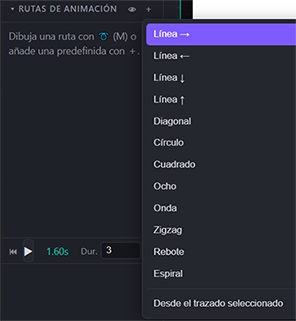

Cada ruta muestra: nombre (doble clic renombra), cuántos objetos la usan (×N) y tres acciones — **➤ asignar** a la selección (admite multiselección), **✒ editar nodos** (misma edición Bézier; los objetos suscritos se actualizan en vivo) y **🗑 eliminar** (avisa si está en uso). Al pasar el ratón por un elemento, su ruta se ilumina en el lienzo; **👁** las muestra todas.

En el lienzo, las rutas se dibujan discontinuas en ámbar con un punto **verde** (inicio) y **rojo** (fin).

### 🛣️ Controlar el recorrido

Con la ruta asignada, en Propiedades → Trayectoria de movimiento:

- 🛣️ **Trazado** — qué ruta sigue (de la biblioteca o una capa de trazado); "— ninguna —" la quita.
- 🔗 **Orientar** — el objeto rota siguiendo la tangente de la ruta (como un coche en una carretera).
- 🔑 **Progreso %** — la propiedad animable `Trayecto %`. Las claves 0→100 se crean solas al asignar; edítalas para cambiar ritmo, ir y volver (0→100→0), o recorrer solo un tramo. El easing de estas claves controla la aceleración del recorrido.

El movimiento de ruta se **suma** a las demás transformaciones (rotación, escala, etc. siguen funcionando encima).

---

## 11. Morphing de geometría
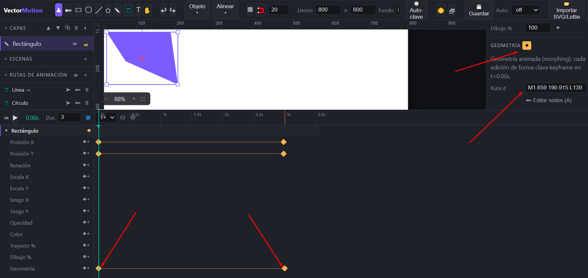
La propiedad **Geometría** anima la *forma misma* del objeto, como los shape layers de After Effects.

### 💼 Flujo de trabajo

1. Selecciona el objeto y pulsa el ◆ junto al encabezado **Geometría** — se clava una instantánea de la forma en el tiempo actual.
2. Muévete a otro instante.
3. **Edita la forma**: medidas en Propiedades, nodos con la herramienta A, texto, lados del polígono… Cada edición crea/actualiza automáticamente la clave de geometría de ese instante.
4. Reproduce: la forma se transforma progresivamente entre claves.

### ℹ️ Qué interpola cada tipo

- 🔘 **Rectángulo**: posición, tamaño y radio de esquinas.
- 🏫 **Elipse**: centro y radios.
- **Línea**: ambos extremos.
- ⭐ **Polígono/estrella**: centro, radio, radio interior y **número de lados** (cambia de forma discreta: una estrella puede volverse pentágono).
- 🔑 **Trazado**: el atributo `d` completo. Si dos claves tienen la misma estructura de nodos, se interpolan exactamente; si no (p. ej. un cuadrado → una estrella de pluma), ambas se **re-muestrean** a curvas Bézier equivalentes y el morph funciona igual — es el "morph cualquier cosa con cualquier cosa".
- 📄 **Texto**: tamaño, espaciado, posición, y el **contenido**: entre textos distintos se hace una transición de contracción/expansión de caracteres.
- 🎨 Los colores incluidos en la instantánea también se interpolan (aunque para color puro es mejor la propiedad Color).

### ℹ️ Notas

- 🔑 Mientras la geometría está animada, los campos de Propiedades muestran el valor **interpolado** del instante actual, y editar cualquiera clava keyframe (la nota bajo el encabezado lo recuerda).
- 🕸️ El editor de nodos trabaja sobre la forma del instante actual — puedes esculpir pose a pose.
- 🔑 Convertir a trazado una forma con geometría animada descarta esas claves (la app pide confirmación).
- 💻 Exportación: fiel en JS; en SMIL y CSS las formas se convierten a `<path>` con estructuras normalizadas (el morphing de *contenido* de texto solo existe en la exportación JS).

---

## ✨ 12. Trazo autodibujable
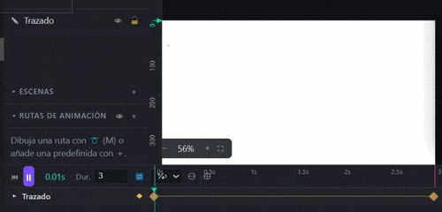

El clásico efecto "el dibujo se dibuja solo" (técnicamente `stroke-dasharray`/`stroke-dashoffset`).

Aquí tienes la explicación paso a paso de cómo crear el efecto de Trazo autodibujable (el efecto de que una línea o forma se va dibujando sola en pantalla):

Paso 1: Crear o seleccionar la forma 

Dibuja cualquier forma en el lienzo (puede ser un rectángulo, una elipse, una línea, o incluso un trazado libre hecho con la pluma ✎). Luego, asegúrate de tenerla seleccionada.

Paso 2: Configurar la apariencia (colores) 

Ve al panel flotante de Propiedades y busca la sección Apariencia.

Dale un color de Trazo (el contorno). Si quieres que sea puramente una línea dibujándose, asegúrate de quitarle el relleno (haz clic en el botón ∅ junto a "Relleno").
Paso 3: Preparar la animación (Fotograma inicial)

Mueve el cursor en tu línea de tiempo (abajo) al instante donde quieres que empiece a dibujarse la forma (por ejemplo, en el segundo 0).
En el panel de Propiedades, dentro de Apariencia, busca la propiedad Dibujo %.
Cambia el valor de Dibujo % a 0. Esto hará que la línea desaparezca (porque el 0% de la línea está dibujada).
Haz clic en el rombo (◆) que está junto a "Dibujo %" para crear un keyframe (fotograma clave) en ese instante.

Paso 4: Terminar la animación (Fotograma final)

Mueve el cursor en la línea de tiempo hacia adelante, al instante donde quieres que el dibujo termine de trazarse (por ejemplo, en el segundo 2).
Vuelve al panel de Propiedades y cambia el valor de Dibujo % a 100. Esto hará que la línea se vea completa nuevamente y automáticamente se creará otro keyframe.
¡Listo! Si le das al botón de reproducir (o presionas la barra espaciadora), verás cómo la forma pasa del 0% al 100% dibujándose poco a poco a lo largo de ese tiempo.

💡 Tip Pro: Si haces clic en el primer fotograma clave (el rombo en la línea de tiempo) y le cambias el "Easing" a Ease In-Out, el movimiento empezará suave, acelerará un poco en medio y terminará suave, haciendo que el efecto de que alguien lo está dibujando se vea mucho más orgánico y natural.

Funciona con rectángulos, elipses, líneas, polígonos y trazados (también con subtrazados múltiples). Con easing Ease In-Out el efecto queda muy natural. Combínalo con la pluma: escribe una palabra a mano alzada, suavízala y hazla autodibujarse.

Se exporta en CSS, SMIL, JS y en el fotograma estático (SVG/PNG).

---

## 13. Efectos de vídeo

La sección **Efectos de vídeo** de Propiedades aplica presets de entrada/salida generando keyframes normales (visibles y editables en el timeline) **a partir del tiempo actual** sobre todos los objetos seleccionados.

| Efecto                                      | Propiedades que anima                       |
| ------------------------------------------- | ------------------------------------------- |
| Aparecer / Desaparecer (fundido)            | Opacidad 0⇄actual                          |
| Fundir a oscuro / desde oscuro              | Color → negro / negro → color             |
| Acercar (entrada) / Alejar (salida)         | Escala 0⇄actual + opacidad                 |
| Entrar desde izquierda/derecha/arriba/abajo | Posición desde fuera del lienzo (ease out) |
| Salir hacia izquierda/derecha/arriba/abajo  | Posición hacia fuera del lienzo (ease in)  |
| Entrada girando                             | Rotación −360° + opacidad                |
| Pulso                                       | Escala 1→1.2→1                            |
| Parpadeo                                    | Opacidad alternante (5 claves)              |

Elige efecto y duración, colócate en el instante donde debe **empezar**, y pulsa Aplicar. Los efectos se encadenan: entrada en t=0, pulso en t=1.5, salida en t=3. Como son keyframes corrientes, luego puedes retocar tiempos, easing o valores a mano.

---

## ✨ 14. Escenas y transiciones

Las **escenas** organizan la película en segmentos consecutivos, como diapositivas o clips de un editor de vídeo, con transiciones automáticas entre ellas.

### Modelo

- ✨ Cada escena tiene **nombre, duración** y **transición de entrada** (cómo aparece *desde la anterior*): Corte, Fundido, Empuje ← → ↑ ↓, o Zoom, con su propia duración de transición.
- ℹ️ Cada capa **pertenece a una escena** o es **🌐 global** (visible siempre — fondos, marcos, logotipos).
- 📄 La duración total del documento pasa a ser la suma de las escenas (se recalcula sola).
- 🖥️ Durante la ventana de transición, la escena saliente y la entrante se solapan: la nueva entra con su efecto mientras la anterior sale con el inverso (fundido cruzado, empuje coordinado, etc.).

### Uso

1. Panel **Escenas** → ＋. La primera escena absorbe las capas existentes; las siguientes nacen con transición "Fundido" de 0.5 s.
2. Por cada escena: duración, transición y su duración se editan en la propia tarjeta; doble clic renombra; clic en el nombre lleva el cabezal a su inicio; 🗑 la elimina (sus capas pasan a globales).
3. Asigna capas: selección + **➤** en la tarjeta, o la fila **Escena** en Propiedades. Las capas nuevas se asignan automáticamente a la escena del tiempo actual.
4. La regla del timeline muestra **bandas de color** con la extensión de cada escena; la tarjeta de la escena activa se resalta.

Las animaciones de las capas siguen siendo globales en el tiempo — coloca sus keyframes dentro del rango de su escena (usa las bandas y el clic-en-nombre para ubicarte). Las transiciones se aplican *encima* de las animaciones propias de cada capa, y se exportan en CSS, SMIL y JS.

---

## 15. Papel cebolla

El botón **🧅** superpone fantasmas de fotogramas vecinos mientras editas con el cabezal parado: **rojizos** los anteriores, **verdosos** los siguientes (dos por lado, ±0.12 s cada uno, más tenue cuanto más lejano).

Sirve para enseñar **spacing**: al posar con auto-clave, los fantasmas muestran cuánto "viaja" el objeto entre instantes — separaciones grandes = rápido, pequeñas = lento. Se ocultan durante la reproducción y nunca se exportan.

---

## 🖥️ 16. Lienzo desacoplable (segunda pantalla)

El botón **🗗** abre el lienzo en una **ventana independiente**: un espejo en vivo, limpio (sin reglas, cuadrícula ni marcas de selección), sincronizado fotograma a fotograma con todo — transformaciones, colores, morphing, escenas.

Arrástrala a un proyector o segunda pantalla para que la clase vea la animación mientras tú trabajas en la principal con todos los paneles. El mismo botón (o cerrar la ventana) la acopla de nuevo. Si el navegador bloquea la ventana emergente, permite pop-ups para el archivo.

---

## 17. Navegación del lienzo, cuadrícula y reglas

- ⭐ **Zoom**: `Ctrl+rueda` (centrado en el cursor), o los botones −/+ y ⛶ (ajustar a ventana) del indicador inferior. Rango 5%–3200%.
- ⋯ **Paneo**: rueda = vertical; `Shift+rueda` = horizontal; **botón central**, **Espacio+arrastrar** o herramienta **Mano (H)**.
- 📄 **Reglas** en px del documento, sincronizadas con zoom y paneo.
- 🕸️ **▦ Cuadrícula** con tamaño configurable y **🧲 imán** que ajusta dibujo, movimiento, nodos y origen a la rejilla.
- 📋 **Lienzo**: ancho × alto y color de fondo en la barra superior. El fondo es *solo de vista*: no se exporta (ver [§18](#-18-importar-y-exportar)).

---

## 📥 18. Importar y exportar

### 📤 Importar

- ℹ️ **📂 Importar SVG/Lottie** admite **selección múltiple**, y también puedes **arrastrar y soltar** archivos .svg directamente sobre el lienzo. Cada archivo entra como capa(s) sin borrar lo existente; si el lienzo estaba vacío, adopta el tamaño del primer SVG.
- ✏️ Los `<defs>` y `<style>` del SVG se conservan. Cada elemento raíz llega como capa 🧩 (raw); desagrupa para editar sus partes.
- 🔑 **Lottie (.json)**: el mismo botón (que ahora acepta `.json`) importa animaciones **Lottie/Bodymovin** — las de LottieFiles o exportadas de After Effects. Se convierten a capas y keyframes nativos, totalmente editables: capas de formas con trazados Bézier (`sh`, con sus tangentes → curvas editables por nodos), rectángulos, elipses y estrellas/polígonos (→ tu herramienta de polígono), rellenos y trazos con sus colores, y la animación de transformación completa (posición, rotación, escala, opacidad, sesgo). El punto de ancla de After Effects se mapea al origen ⌖ (las rotaciones giran donde deben), los fotogramas se convierten a segundos según `fr`, la duración del documento se ajusta a `(op−ip)/fr`, y los easings Bézier de cada keyframe se aproximan a la curva con nombre más parecida (los keyframes "hold" se vuelven Escalón). Se omiten con aviso: precomposiciones, texto, imágenes, emparentado entre capas, degradados, trim paths, repetidores y transformaciones de grupo animadas (las estáticas se hornean en la geometría). Un archivo `.lottie` (dotLottie) es un ZIP: descomprímelo y usa el `.json` interior.
- 💻 **Abrir proyecto (.json)** restaura un proyecto completo con animaciones, rutas y escenas.

### 📥 Exportar (menú ⬇ Exportar)

| Formato                 | Qué contiene                                     | Ideal para                                                           |
| ----------------------- | ------------------------------------------------- | -------------------------------------------------------------------- |
| **SVG estático**       | El fotograma actual congelado                     | Ilustraciones, apuntes                                               |
| **SVG animado — CSS**  | `@keyframes` + `d:path()` para morphing           | Web moderna; ligero y editable a mano                                |
| **SVG animado — SMIL** | `<animate>`/`<animateMotion>` nativos             | Funciona incluso como ``; el formato más autónomo              |
| **SVG animado — JS**   | Motor de interpolación incrustado                | Máxima fidelidad (100% igual al editor, incluido morphing de texto) |
| **Código GSAP**         | HTML con el SVG + `gsap.timeline()` legible       | Desarrolladores que trabajan con GSAP                                |
| **PNG**                 | Fotograma actual rasterizado, escala configurable | Miniaturas, documentos                                               |

Notas:

- ❓ **Fondo transparente**: los cuatro formatos SVG nunca incluyen el color de fondo del lienzo. El PNG pregunta si lo quieres con fondo o transparente.
- 🔑 Todo se exporta: keyframes, easing personalizado, rutas de movimiento, morphing, trazo autodibujable, efectos y transiciones de escena. Peculiaridades: SMIL recorta el overshoot de curvas personalizadas; el morphing del *contenido* de texto solo va en JS; CSS convierte a `<path>` las formas con geometría animada.
- 🔁 Las animaciones exportadas duran lo que marque **Dur.** y se repiten en bucle infinito.
- 🔑 **Código GSAP**: genera un HTML autoexplicativo con el SVG inline y una timeline comentada por capa — `gsap.set()` inicial (con `svgOrigin` en tu origen ⌖) y un `tl.to()` por cada tramo entre keyframes, posicionado en tiempo absoluto. Tus easings se traducen a los nombres de GSAP (`expo.in`, `back.out(1.7)`, `elastic.out(1,0.3)`, `bounce.out`…) y las rutas de movimiento a `motionPath` con `start`/`end` por tramo y `autoRotate` (carga MotionPathPlugin solo si hace falta). GSAP se carga desde CDN, así que este formato necesita conexión (o guarda `gsap.min.js` junto al HTML y cambia la ruta del `<script>`). Pensado para entregar a quien integra la animación en un proyecto web con GSAP.

---

## ✨ 19. Guardar, autoguardado y proyectos

- 💻 **💾 Guardar** (`Ctrl+S`): la primera vez eliges dónde guardar el `.json`; las siguientes escribe **en el mismo archivo** sin diálogos (Chrome/Edge; en otros navegadores descarga el archivo).
- 🛡️ **Auto:** junto al botón — autoguardado cada 30 s / 1 / 2 / 5 min, al archivo elegido y siempre con **copia de seguridad en el navegador**. El intervalo se recuerda.
- 🛡️ Al abrir la app con lienzo vacío, si hay copia de seguridad se ofrece **restaurarla** (con fecha y hora).
- 💻 El menú Exportar conserva **Guardar proyecto (.json)** (descarga clásica) y **Abrir proyecto**.
- 💻 El proyecto guarda todo: documento, capas, animaciones, rutas, escenas y defs importados. Es JSON legible — otra oportunidad didáctica.

---

## 👤 20. Personalizar la interfaz

- 💻 **Secciones plegables**: clic en los títulos *Capas*, *Escenas* o *Rutas de animación* pliega/despliega cada sección (chevron ▾/▸).
- 📚 **Columna izquierda completa**: el botón **⏴** (junto a los botones de capas) colapsa toda la columna a una tira fina; **⏵** la restaura.
- 🖼️ **Altura del timeline**: arrastra su borde superior.
- ✨ Todo (secciones, columna, altura, intervalo de autoguardado) se recuerda entre sesiones.

---

## ⌨️ 21. Atajos de teclado

| Atajo                                   | Acción                                                                                     |
| --------------------------------------- | ------------------------------------------------------------------------------------------- |
| `V` `A` `R` `E` `L` `G` `P` `M` `T` `H` | Herramientas (selección, nodos, rect, elipse, línea, polígono, pluma, ruta, texto, mano) |
| `Espacio`                               | Reproducir / pausa                                                                          |
| `Espacio` (mantenido) + arrastrar       | Paneo del lienzo                                                                            |
| `Ctrl+Z` / `Ctrl+Y` (o `Ctrl+Shift+Z`)  | Deshacer / rehacer                                                                          |
| `Ctrl+S`                                | Guardar proyecto                                                                            |
| `Ctrl+G` / `Ctrl+Shift+G`               | Agrupar / desagrupar                                                                        |
| `Supr` / `Retroceso`                    | Eliminar capa, nodo o keyframe seleccionado                                                 |
| Flechas / `Shift`+flechas                | Mover selección 1 px / 10 px                                                               |
| `Enter`                                 | Terminar trazado de pluma                                                                   |
| `Esc`                                   | Cancelar pluma o ruta, salir de nodos, cerrar popup, deselección                           |
| `Shift`+dibujar                         | Cuadrado / círculo / proporción al escalar / rotación en pasos de 15°                   |
| `Alt`+arrastrar manejador               | Romper simetría del nodo                                                                   |
| `Alt+clic` en la regla                  | Fijar/quitar bucle A-B                                                                      |
| `Ctrl+rueda`                            | Zoom (lienzo) / desplazamiento horizontal (timeline)                                        |
| `Shift+rueda`                           | Paneo horizontal del lienzo                                                                 |

---

## 💡 22. Ideas para el aula

1. **La pelota que rebota** (el "hola mundo" de la animación): elipse + claves de posición Y + editor de curvas con overshoot para el squash visual del timing. Analízalo a ¼× con bucle A-B y papel cebolla.
2. **Los 12 principios, uno a uno**: anticipación con curvas personalizadas; arcos con la ruta a mano alzada; entrada/salida lenta comparando presets de easing en dos copias del mismo objeto.
3. **Morphing conceptual**: círculo → estrella → letra inicial del nombre; discute por qué el morph re-muestrea las curvas.
4. **Caligrafía animada**: escribir con la pluma, suavizar, trazo autodibujable de 0→100.
5. **Mini-película de tres escenas**: presentación, nudo y desenlace con transiciones distintas; personaje global que persiste entre escenas.
6. **Ingeniería inversa**: exporta el mismo proyecto en CSS, SMIL y JS y compara los tres códigos — tres tecnologías de animación web en un solo ejemplo.

---

## ⚠️ 23. Solución de problemas

- 📄 **"El navegador bloqueó la ventana emergente"** al desacoplar el lienzo → permite pop-ups para el archivo y vuelve a pulsar 🗗.
- 💻 **"Comandos no compatibles (arcos o coordenadas relativas)"** → ese trazado usa `A` o comandos relativos; solo afecta a edición de nodos, unión y morphing. Redibuja con la pluma o edítalo como capa normal.
- ✨ **El trazo autodibujable no se ve** → la forma no tiene color de trazo, o Dibujo % está en 100 sin animar.
- 🗄️ **Guardar siempre descarga en vez de escribir el archivo** → tu navegador no soporta la File System Access API; usa Chrome/Edge o trabaja con descargas + Abrir proyecto.
- 🗄️ **No aparece el aviso de autoguardado al abrir** → solo se ofrece si el lienzo está vacío y hay copia con contenido; el almacenamiento del navegador puede borrarse al limpiar datos de sitios.
- 💻 **La exportación CSS no morfea en algún navegador** → `d: path()` en CSS requiere Chrome/Edge/Firefox recientes; usa la exportación SMIL o JS como alternativa.
- 💻 **La animación exportada va "a saltos" en las transiciones de escena** → es normal en SMIL con muchas capas; la exportación JS es la más fluida.
- 🚀 **Un objeto "salta" al asignarle una ruta** → la ruta manda: el objeto se coloca en su punto de inicio (verde). Dibuja la ruta empezando donde está el objeto, o usa los presets (que ya nacen anclados a él).
- 💻 **"El JSON no parece una animación Lottie"** → al archivo le falta la lista `layers`. Si el archivo empieza por `PK`, es un dotLottie (ZIP): descomprímelo y usa el `.json` interior.
- 📄 **Un Lottie importado se ve incompleto o estático** → usa rasgos aún no soportados (precomposiciones, texto, imágenes, degradados, trim paths…). El aviso tras importar indica cuántas capas se omitieron y cuántos rasgos se aproximaron; lo importado sigue siendo editable.
- 💻 **La exportación GSAP no se mueve al abrirla** → sin conexión el CDN no carga; descarga `gsap.min.js` (y `MotionPathPlugin.min.js` si usas rutas) y apunta los `<script>` a los archivos locales.

---

*VectorMotion es un proyecto educativo de código abierto en un solo archivo. Ábrelo, mira dentro — el propio editor es la última lección del curso.*
